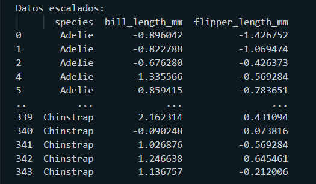

# ※ Clasificador de especies de Pingüinos

Este programa utiliza un modelo de _machine learning_ en el cual se entrena una _red neuronal_ dado un _Dataset_ que contiene información relacionada a 3 especies de Pingüinos (Adelie, Chinstrap y Gentoo) asi como sus características como el largo de su pico y el largo de sus aletas.

La librería utilizada es [scikit-learn](https://scikit-learn.org/stable/install.html), la red neurnal usada pertenece al módulo [sklearn.neural_network](https://scikit-learn.org/stable/modules/neural_networks_supervised.html) y el _dataset_ usado es [palmerpenguins](https://github.com/allisonhorst/palmerpenguins).

## ※ Código 

La clase encargada de realizar la clasificación se encuentra en el archivo [PenguinClassifier.py](https://github.com/ivansteezy/PenguinClassifier/blob/main/src/PenguinClassifier.py) la cual tiene la función de ser un _wrapper_ para los parámetros necestarios para construir una instancia de la clase [```MLPClassifier```](https://scikit-learn.org/stable/modules/generated/sklearn.neural_network.MLPClassifier.html#sklearn.neural_network.MLPClassifier) que es la encargada de realizar la tarea requerida.

La clase ```MLPClassifier``` implementa un perceptrón multicapa, el cual se entrena utilizando el algoritmo de [Propagación hacia atrás (Backpropagation)](https://es.wikipedia.org/wiki/Propagaci%C3%B3n_hacia_atr%C3%A1s).

Se puede crear una instacia _via_ constructor de ```PenguinClassifier``` es tal que:

```py
PenguinClassifier((50, 50, 50), 100, 'relu', 'lbfgs', 0.3)
```

A grandes rasgos se cuentan con 5 parámetros:

- Primero se define el número de _capas ocultas_ con las que contará la red neuronal, en este caso 3 capas de 50 nodos cada una.

<center>

<em>Capas ocultas en una red neuronal</em>
</center>
<br>

- El segundo parámetro es el número de iteraciones (o [epochs](https://radiopaedia.org/articles/epoch-machine-learning)) que se desea que ejecute. Una iteracion corresponde al ciclo compuesto por la "alimentación hacia adelante" (feed-forward) y la propagación hacia atras(backpropagation).

- El tercero es la función de activacion para las capas ocultas, hay 4 opciones:
    - 'identity', retorna ```f(x) = x```
    - 'logistic', retorna ```f(x) = 1 / (1 + exp(-x))```
    - 'tanh', retorna ```f(x) = tanh(x)```
    - 'relu', retorna ```f(x) = max(0, x)```

    para esta tarea se utilizó _relu_ (es relativamente fácil de procesar, es la opción por defecto sklearn también)

- El cuarto es el algoritmo de optimización, sklearn da 3 opciones:
    - 'lbfgs' es un optimizador de la familia de los metodos quasi-Newton
    - 'sgd' es un deceso gradiente estocástico
    - 'adam' es una extension del anterior

    Por defecto, sklearn utiliza la opción de _adam_, sin embargo, en la documencion oficial hace un paréntesis  destacando que adam funciona bien en cojuntos de datos relativamente grandes (miles de datos de entramiento ó más, por ejemplo) y que para pequeños conjuntos de datos 'lbfgs' se desempeña mejor, por lo que fue el que se usó en esta tarea.

- Y por último el porcentaje con el cual se quieren tomar los datos, en este caso el 70% (representado en un rango 0.0 a 1.0, siendo por ejemplo 0.3 el 70%, 0.2 el 80%, etc).

### ※ Preparación de datos
Primero, se hace la importación de los datos con los cuales se trabajará.

```py
from palmerpenguins import load_penguins

class PenguinClassifier:
    #...
    # obtenemos y sanitizamos los datos
    def __FetchData(self):
    self.__rawData = load_penguins().dropna()[['species', 'bill_length_mm','flipper_length_mm']]
    self.__ScaleData()

    # escalamos los datos a un nuevo rango
    def __ScaleData(self):
        self.__scaler = StandardScaler()
        self.__rawData[['bill_length_mm','flipper_length_mm']] = self.__scaler.fit_transform(self.__rawData[['bill_length_mm','flipper_length_mm']])
```

Cargamos los datos con la función ```load_penguins()``` y eliminamos los valores no existentes con ```dropna()```, para esta tarea utilizaremos únicamente las característica ```species```, ```bill_length_mm``` y ```flipper_length_mm```, para justo después escalar los datos a un rango estandarizado para aumentar la precisión.

En este punto los datos se ven algo así: 
<center>

</center>

### ※ Entrenamiento de la red neuronal

```py
from sklearn.neural_network import MLPClassifier
from sklearn.model_selection import train_test_split

class PenguinClassifier:
    #...

    # Se entrena la red neuronal tomando una porcion de los datos al azar
    # y se dividen en dos colecciones, una que contiene 'bill_length_mm' y 'flipper_length_mm'
    # y otra que contiene 'species'
    def TrainNeuralNetwork(self):
        trainingSet = train_test_split(self.__rawData, test_size=self.__trainingDataSetSize, random_state=20)
        self.__yTrainer = trainingSet[0]['species'].values
        self.__xTrainer = trainingSet[0][['bill_length_mm', 'flipper_length_mm']].values
        self.__SetExpectedResults()
        self.__classifier = MLPClassifier(hidden_layer_sizes=self.__hiddenLayers,
                                            max_iter=self.__maxIterations,
                                            activation=self.__activationFun, 
                                            solver=self.__solver, random_state=21)
        self.__classifier.fit(self.__xTrainer, self.__yTrainer)
```

Antes de entrenar a la red neuronal es necesario seleccionar los datos de entrada y los datos objetivo (```yTrainer``` y ```xTrainer``` en el fragmento de código) para despues almacenar los datos origininales para hacer una comparación con la predicción, esto con ```SetExpectedResults()```

```py
    def  __SetExpectedResults(self):
        self.__xValues = self.__rawData[['bill_length_mm', 'flipper_length_mm']].values
        self.__yValues = self.__rawData['species'].values
```

Por último solo se entrena la red con ```fit()``` y los datos de entrenamiento.

### ※ Predicción y precisión
Para hacer una prediccion con la red neuronal basta hacer ```predict()``` con el 100% de los datos (```xValues```)

```py
    def PredictData(self):
        self.__predictionResults = self.__classifier.predict(self.__xValues)
        self.__xValues = self.__scaler.inverse_transform(self.__xValues)
        confusionMatrix = confusion_matrix(self.__predictionResults, self.__yValues)
        self.__CalculateAccuracyPercentage(confusionMatrix)
```

Para calcular el porcentaje de la precisión de la predicción se utiliza la matriz de confusión la cual es dada por ```sklearn.metrics.confusion_matrix()```.

Una matriz de confusión tiene la siguiente forma

<center>

</center>

Las etiquetas positivo/negativo se refiere al resultado previsto de un experimento, mientras que las etiquetas verdadero/falso se refieren al resultado real.

Por lo que la fórmula  para calcular la precisión sería todos las predicciones correctas dividido por todas las predicciones:

<center>
 a(x) = VP + VN / (VP + VN + FP + FN)
</center>

- VP: Verdadero positivo
- VN: Verdadero negativo
- FP: Falso positivo
- FN: Falso negativo

Lo que se podría definir como la suma de la diagonal principal de la matriz dividido por la suma de todos los elementos de la matriz:

```py
def __CalculateAccuracyPercentage(self, confusionMatrix):
        diagonalSum = confusionMatrix.trace()
        sumOfAllElements = confusionMatrix.sum()
        self.__accuracyPercentage = (diagonalSum / sumOfAllElements) * 100
```

### ※ Resultados

Por último se generá un archivo csv que contiene los [datos de entrenamiento](output-data/training-data.csv) y un csv con las [predicciones obtenidas](output-data/predicted-data.csv) donde se puede ver los errores que tuvo.


Con los parámetros mostrados, el porcentaje de precisión fue de un **97.8979%**.

Hice pruebas con distintos parámetros y estos fueron los resultados.

|Escalados|Capas|Iteraciones|Función de activación|Optimizador|Porcentaje de datos de entrenamiento|Precisión|Tiempo|
|---|---|---|---|---|---|---|---|
|Si|(50, 50, 50)|100|relu|lbfgs|70%|97.8979%|1.335 segs.|
|Si|(50, 50, 50)|100|tanh|lbfgs|70%|97.2973%|3.973 segs.|
|Si|(50, 50, 50)|100|relu|adam|70%|95.7958%|1.396 segs.|
|Si|(50, 50, 50)|100|logistic|sgd|70%|43.8438%|1.253 segs.|
|Si|(50, 50, 50)|100|logistic|sgd|70%|43.8438%|1.253 segs.|
|Si|(200, 200, 200)|500|logistic|sgd|90%|43.8438%|1.332 segs.|
|No|(50, 50, 50)|100|relu|lbfgs|70%|72.3724%|1.394 segs.|
|No|(200, 200, 200)|500|relu|lbfgs|80%|96.0961%|7.913 segs.|
|Si|(100, 100, 100)|500|relu|lbfgs|80%|98.1981%|3.208 segs.|
